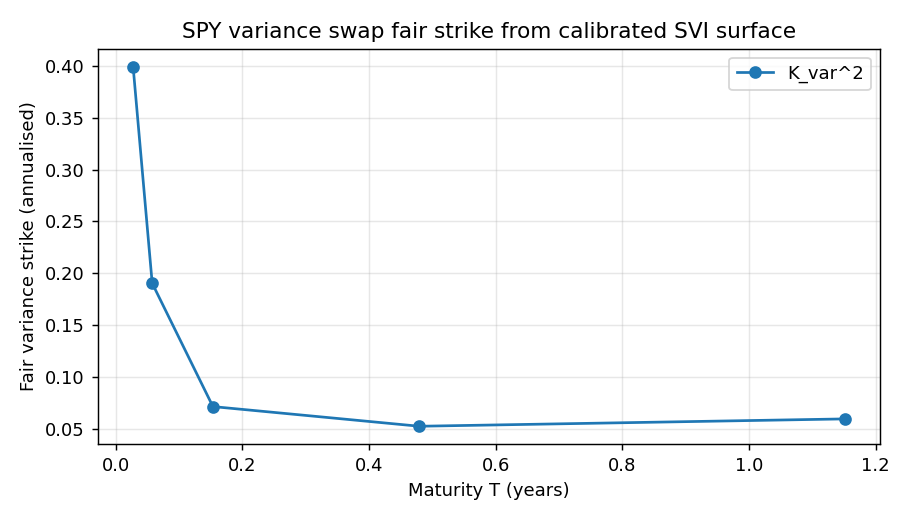

# vol-derivatives-pricer

A small library for pricing variance swaps, vol swaps, and a couple of exotic structured notes (range accruals and shark fin notes) off a calibrated implied vol surface.

It builds on top of [arbfree_vol](https://github.com/ishhaaab/Arbitrage-Free-Vol-Surface-Engine). That project handles SVI calibration, implied vol solving, and arbitrage repair. This one takes the finished surface and prices derivatives off it.

## Why this exists

Most pricing projects you see in coursework price vanilla options with a single flat Black-Scholes vol number. That works for a plain call, but it breaks down as soon as the payoff depends on the path or on realised vol. The fair value of a variance swap, a vol swap, or a barrier note is driven by the whole shape of the vol surface: the skew across strikes, the term structure across expiries, and the local vol that actually moves the underlying.

This library is meant to price those instruments the way a real vol desk would source them, using a calibrated SVI surface as the input rather than one at-the-money quote.

## What's in here

Four pricing modules, all driven by the same surface.

**Variance swap.** The fair strike comes from Demeterfi static replication. You integrate 1/K² weighted OTM option prices across a grid of strikes pulled straight from the surface (puts below forward, calls above). The default grid is 4000 log spaced points and the integrand is vectorised with scipy.special.erfc, so it runs in about 30ms. On a flat surface it converges to sigma squared within 5e-4 relative error.

**Vol swap.** A vol swap pays realised volatility, not variance, and because volatility is a concave function of variance there's a convexity gap to correct for. We estimate vol of vol (nu) from the surface skew with a quadratic fit in log moneyness, then apply the Brockhaus-Long adjustment to the variance swap strike. On a skewed surface (b=0.4, rho=-0.4) nu comes out to about 5.94, which is a real and measurable gap versus the flat approximation.

**Range accrual.** Monte Carlo under Dupire local vol with antithetic variates. The local vol is precomputed on a 2D strike by time grid and interpolated during the sim, so Dupire isn't recomputed on every single step. It reports a 95% confidence interval from the pair standard error, which is the textbook correct way to do it with antithetics. On real SPY data (spot 738.25, r 3.79%, q 1.01%) a one year note with a 95% of spot corridor and a 5% coupon prices to PV 0.0301, with a 95% CI of [0.0299, 0.0303].

**Shark fin.** Two methods that we cross check against each other. The closed form uses the reflection principle for a single upper barrier under flat vol. The Monte Carlo runs log Euler with a Brownian bridge barrier check (Glasserman, section 6.2), which fixes the bias you get from monitoring the barrier only at discrete steps. On a flat surface the two agree within about 1 standard error (BS 0.02793, MC 0.02783, difference 1.02 SE). On a skewed surface the MC prices roughly 60% higher (BS 0.01993, MC 0.03198, difference 120.69 SE). That gap is the smile premium. It's a genuine market effect, not Monte Carlo noise.

## How the pieces fit together

arbfree_vol produces a calibrated SVI surface. surface_bridge.py is the only place this library touches it. It wraps the surface and exposes a couple of clean methods. Nothing downstream talks to arbfree_vol directly, which means you could swap in a different calibration method without touching any of the pricing code.

```
arbfree_vol (upstream)
  └── FittedSurface (calibrated SVI)
        └── surface_bridge.py    <- only integration point
              ├── get_iv(strike, expiry)
              ├── get_option_price(strike, expiry, cp)
              ├── get_option_prices(strikes, expiry, cp)   <- vectorised
              └── surface object (direct access)
                    ├── swaps/variance_swap.py   <- Demeterfi replication
                    ├── swaps/vol_swap.py        <- Brockhaus-Long + nu estimator
                    ├── structured/range_accrual.py  <- MC + antithetic + local vol
                    ├── structured/shark_fin.py  <- BS formula + Brownian bridge MC
                    └── structured/local_vol.py  <- Dupire local vol grid
```

## Real SPY numbers

These come from running the examples against live data with load_calibrated_surface("SPY"):

| Expiry | K_var² | σ² | fwd | K_vol | ν |
|--------|--------|----|-----|-------|---|
| 5 days | 0.40 | 0.41 | 1.000 | 0.55 | n/a |
| 36 days | 0.14 | 0.12 | 1.001 | 0.30 | n/a |
| 65 days | 0.11 | 0.11 | 1.001 | 0.27 | n/a |
| 122 days | 0.09 | 0.09 | 1.002 | 0.24 | n/a |
| 357 days | 0.06 | 0.06 | 1.005 | 0.21 | 5.94 |

Range accrual, one year, corridor from 0.9 to 1.1 times spot, 5% coupon: PV 0.0301, 95% CI [0.0299, 0.0303], accrual fraction 0.625.

Shark fin flat surface cross check: BS PV 0.02793, MC PV 0.02783, difference 1.02 SE. Skewed surface: difference 120.69 SE, which is a 60% relative move from the flat vol price.

## Examples

Two end to end demos run on live SPY data. They need network access because they pull quotes through arbfree_vol's yfinance ingestion and calibrate an SVI surface before pricing:

```
python examples/spy_variance_swap.py     # prints K_var^2, K_vol across expiries; saves a PNG
python examples/spy_range_accrual.py     # prices a 1-year note; prints PV with 95% CI; saves a PNG
```

Both use load_calibrated_surface("SPY", max_expiries=24), which is a one line wrapper over the upstream fetch, repair, and fit pipeline. Using 24 expiries means one year pricing stays on surface, since SPY monthlies run out past two years.



## Quick start

```bash
# install in editable mode
pip install -e .

# run the test suite
pytest tests/ -q

# check the top level imports work without touching the network
python -c "from voldrv import SurfaceBridge, fair_variance_strike; print('OK')"

# price off live SPY data (needs network)
python examples/spy_variance_swap.py
python examples/spy_range_accrual.py
```

## Continuous integration

GitHub Actions runs pytest and pyright on every push and pull request to main, across Python 3.11 and 3.12 on Ubuntu and Windows (four jobs total). The examples are left out of CI on purpose because they need network access to fetch data. They're meant to be run locally.

The workflow lives at .github/workflows/ci.yml.

## Project layout

```
vol-derivatives-pricer/
  pyproject.toml
  README.md
  examples/
    spy_variance_swap.py        # live SPY variance + vol swap fair strikes
    spy_range_accrual.py        # live SPY range-accrual MC pricer
    spy_variance_swap.png       # generated plot
    spy_range_accrual.png       # generated plot
  src/
    voldrv/
      __init__.py               # package re-exports
      surface_bridge.py         # wraps arbfree_vol, exposes iv(K,T) and option prices
      swaps/
        __init__.py
        variance_swap.py        # static replication -> fair variance strike
        vol_swap.py             # convexity-adjusted fair vol strike + nu estimator
      structured/
        __init__.py
        local_vol.py            # Dupire local vol from the SVI surface
        range_accrual.py        # MC pricing of range accrual notes
        shark_fin.py            # BS formula + Brownian bridge MC
      data/
        __init__.py             # network-free package init
        loader.py               # load_calibrated_surface("SPY") one-line wrapper
  tests/
    test_surface_bridge.py
    test_variance_swap.py
    test_vol_swap.py
    test_local_vol.py
    test_range_accrual.py
    test_skewed_surface.py
    test_loader.py
    test_shark_fin.py
  bench/
    bench_variance_swap.py      # integrand vectorisation timing
    bench_range_accrual.py      # MC convergence + runtime timing
    README.md                   # benchmark notes
```

## Tech stack

- Python 3.11 or newer
- NumPy and SciPy (the vectorised integrand uses scipy.special.erfc)
- matplotlib, only for the example plots
- yfinance, only inside the examples, pulled in through arbfree_vol
- [arbfree_vol](https://github.com/ishhaaab/Arbitrage-Free-Vol-Surface-Engine) for SVI calibration, IV solving, and arbitrage repair
- Pytest for tests and Pyright for type checking (standard mode)

## References

- Demeterfi, Derman, Kamal, Zou, More Than You Ever Wanted to Know About Volatility Swaps
- Brockhaus and Long, convexity adjustment for volatility swaps from variance swaps
- Dupire, local volatility from the implied vol surface
- Glasserman, Monte Carlo Methods in Financial Engineering, section 6.2 on the Brownian bridge barrier correction
